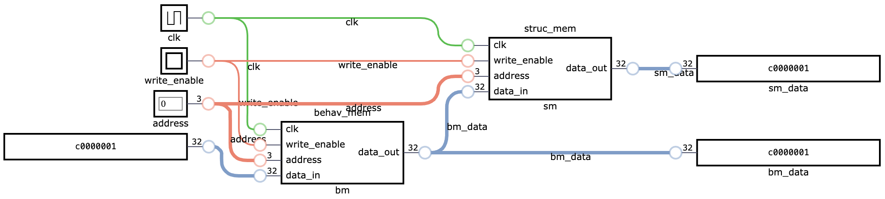
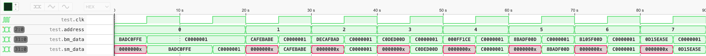

# Entendendo o funcionamento das memórias 

O objetivo desta simulação é [copiar o conteúdo de uma memória para outra](top.sv). A **primeira** memória, descrita em [Verilog Comportamental](behav_mem.sv), já vem configurada com um [conteúdo inicial](values.tv). Já a **segunda** memória, descrita em [Verilog Estrutural](struc_mem.sv), não tem qualquer valor inicial, pois é composta por um arranjo de [registradores](register.sv).

Instancie as duas memórias, concatenando-as, de forma que a saída da **primeira** seja fornecida à **segunda**, para que seu conteúdo seja copiado, conforme a figura. Forneça também o valor `c0000001` para a **primeira**, de forma que todo o seu conteúdo seja sobrescrito por este valor ao longo do teste.

